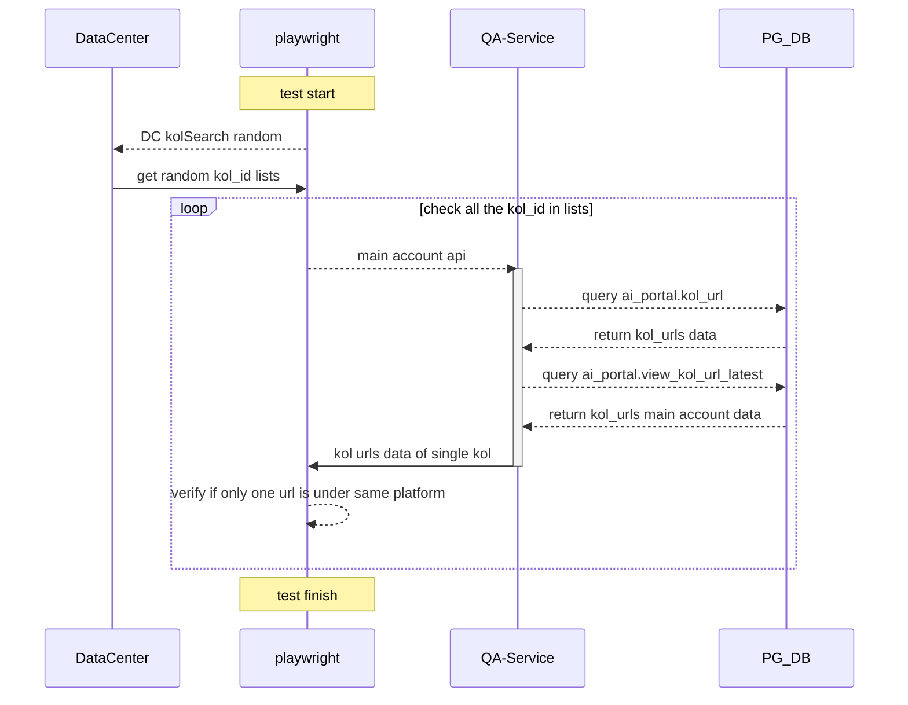
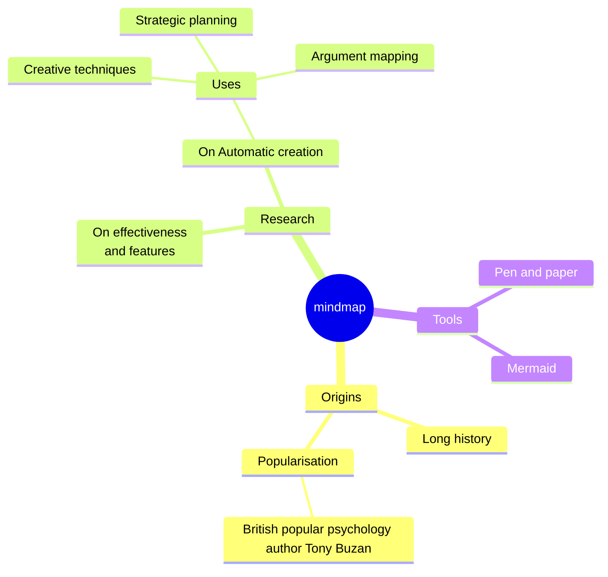
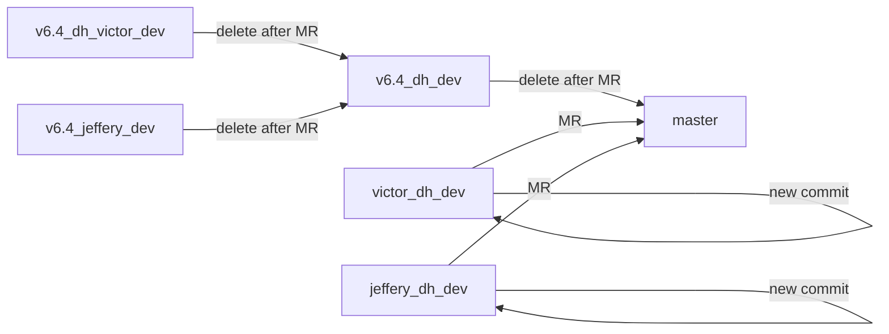

# Mermaid

## Intro 
A diagramming and charting tool that could write diagram in text like content.

一種可以用文字描述繪圖的工具。

It is a JavaScript based diagramming and charting tool that **renders Markdown-inspired text definitions** to create and modify diagrams dynamically.

## Usage
安裝後在 markdown 的 codeblock 中著名 mermaid 即可使用

```text
```mermaid
 graph here....
``

```


## Example

### Sequence Diagram



- text in codeblock
```text
sequenceDiagram
   participant DC as DataCenter
    participant PW as playwright
    participant QAS as QA-Service
    participant PG as PG_DB
    
    note over PW: test start
    PW -->> DC: DC kolSearch random
    DC ->> PW: get random kol_id lists
    
    loop check all the kol_id in lists
    PW -->> QAS: main account api 
    activate QAS
    QAS -->> PG: query ai_portal.kol_url
    PG -->> QAS: return kol_urls data
    QAS -->> PG: query ai_portal.view_kol_url_latest
    PG -->> QAS: return kol_urls main account data
    QAS ->> PW: kol urls data of single kol
    deactivate QAS
    PW -->> PW: verify if only one url is under same platform
    end
    note over PW: test finish
```

### Git Graph
::: info
目前 vitepress mermaid package 好像暫不支援 gitGraph, 繪製不出來, 要體驗可以使用 notion
:::

繪製出的圖如下


```text
gitGraph
   commit id: "regression point"
   branch v6.5_dh_dev
   branch v6.5_dh_jeffery_dev
   branch v6.5_dh_victor_dev
   commit id: "feat v-1"
   commit id: "feat v-2"
   checkout v6.5_dh_jeffery_dev
   commit id: "feat j-1"
   commit id: "feat j-2"
   commit id: "feat j-3"
   checkout main
   commit
   commit
   checkout v6.5_dh_dev
   merge v6.5_dh_victor_dev
   merge v6.5_dh_jeffery_dev
   checkout main
   merge v6.5_dh_dev id:"new regression point"
```


### MindMap



- text in codeblock
```text
mindmap
  root((mindmap))
    Origins
      Long history
      ::icon(fa fa-book)
      Popularisation
        British popular psychology author Tony Buzan
    Research
      On effectiveness<br/>and features
      On Automatic creation
        Uses
            Creative techniques
            Strategic planning
            Argument mapping
    Tools
      Pen and paper
      Mermaid
```

### FlowChart



- text in codeblock
```text
graph LR
  v6.4_dh_victor_dev -- delete after MR --> v6.4_dh_dev
  v6.4_jeffery_dev -- delete after MR --> v6.4_dh_dev
  v6.4_dh_dev -- delete after MR --> master
  
  victor_dh_dev -- MR --> master
  victor_dh_dev -- new commit --> victor_dh_dev
  jeffery_dh_dev -- MR --> master
  jeffery_dh_dev-- new commit --> jeffery_dh_dev

```


## Reference
- [Mermaid GitHub repo](https://github.com/mermaid-js/mermaid)
- [Mermaid Official Website](https://mermaid.js.org/)
- [Mermaid Official Docs](https://mermaid.js.org/intro/)
